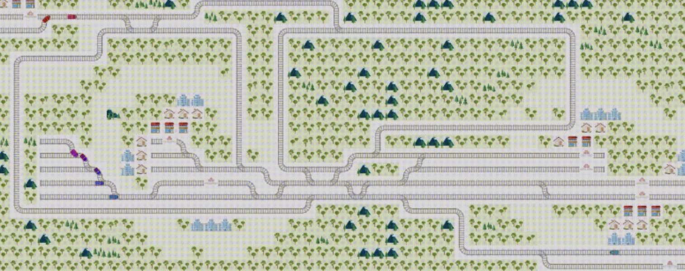
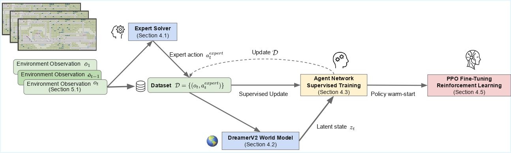

<h1 align="center"><strong>Imitation-Guided World Models for Multi-Agent Train Rescheduling</strong></h1>

<p align="center">
  <strong>Max Bourgeat<sup>1,2</sup></strong>&emsp;
  <strong>Antoine Legrain<sup>1,2,3</sup></strong>&emsp;
  <strong>Quentin Cappart<sup>1,2,4</sup></strong>
</p>

<p align="center">
  <sup>1</sup>Polytechnique Montréal, Montreal, Canada<br>
  <sup>2</sup>CIRRELT, Montreal, Canada<br>
  <sup>3</sup>GERAD, Montreal, Canada<br>
  <sup>4</sup>UCLouvain, Louvain-la-Neuve, Belgium
</p>

## 🏠 About
Managing railway disruptions is a complex multi-agent routing problem where a single train failure can propagate delays across the network. Traditional approaches rely on heuristic optimization solvers, which are effective but assume access to a global system view and require substantial expert design, limiting their applicability and generalization.
Reinforcement learning (RL) offers an alternative by learning adaptive strategies from interactions with the environment. In this paper, we show that none of the available paradigms is sufficient in isolation: (i) heuristic solvers encode valuable global expertise but cannot be deployed directly, (ii) world models improve sample efficiency but struggle to leverage expert knowledge, and (iii) pure RL can adapt policies but often lacks stability without strong guidance.
We propose a hybrid framework that integrates the strengths of these approaches. First, imitation learning transfers knowledge from a global expert solver to initialize a neural policy. Then, model-based RL fine-tunes this policy using the DreamerV2 world model to enhance generalization and responsiveness to local perturbations. Our method builds on the Multi-Agent Model-Based Architecture (MAMBA) to model agent interactions and addresses the challenge of transferring expertise from global solvers to decentralized agents operating on local latent observations.
Experiments on a train rescheduling problem using the Flatland environment show that our method outperforms MAMBA, improving performance by up to 23\% on difficult instances. This highlights the benefit of combining imitation learning with world-model-based multi-agent RL for complex transportation networks.
<!--  -->
<div style="text-align: center;">
    
</div>

## 🔍 Overview

### Framework
<div style="text-align: center;">
    
</div>


## Instructions
This code accompanies the paper "Imitation-Guided World Models for Multi-Agent Train Rescheduling".

## Installation

`python3.9` is required

```
pip install wheel
pip install flatland-2.2.2/
pip install -r requirements.txt 
```

## Install the solver
To install the solver, follow the procedure you can found here:  
[https://github.com/Jiaoyang-Li/Flatland](https://github.com/Jiaoyang-Li/Flatland)
Once you installed it, you need to move the ```libPythonCBS.so``` file into ```agent/solver/```.

## Usage

All the configuration files are already setup to replicate the main results of the paper. If you want to replicate the abltaion studies you should modify the files ```configs/dreamer/DreamerControllerConfig.py``` and ```configs/dreamer/DreamerLearnerConfig.py```. For example, if you want to modify the expert for the random or greedy expert you should replace ```self.EXPERT_TO_FOLLOW = "solver"``` by ```self.EXPERT_TO_FOLLOW = "random"``` or ```self.EXPERT_TO_FOLLOW = "greedy"``` in ```configs/dreamer/DreamerControllerConfig.py```. If you want to remove the world model (DreamerV2) you should set ```self.ABLATION_WM``` to ```True``` in ```configs/dreamer/DreamerControllerConfig.py``` and ```configs/dreamer/DreamerLearnerConfig.py```. And if you want to train in a full imitation learning fashion without reinforcement learning you should set ```self.STEPS_SEQUENTIAL_RL_PHASE``` to ```0``` in ```configs/dreamer/DreamerLearnerConfig.py```.
```
python3 train.py --n_workers 2 --env flatland --env_name 5_agents
```

## Code Structure

- ```agent``` contains implementation of MAMBA 
  - ```controllers``` contains logic for inference
  - ```learners``` contains logic for learning the agent
  - ```memory``` contains buffer implementation
  - ```models``` contains architecture of MAMBA
  - ```optim``` contains logic for optimizing loss functions
  - ```runners``` contains logic for running multiple workers
  - ```solver``` contains logic for using the solver
  - ```utils``` contains helper functions
  - ```workers``` contains logic for interacting with environment
- ```env``` contains environment logic
- ```networks``` contains neural network architectures


## 👏 Acknowledgements
- [MAMBA](https://github.com/jbr-ai-labs/mamba): Our codebase is built upon MAMBA.
- [MAPF Solver](https://github.com/Jiaoyang-Li/Flatland): Our codebase used the winning solver solution of the Flatland challenge.
